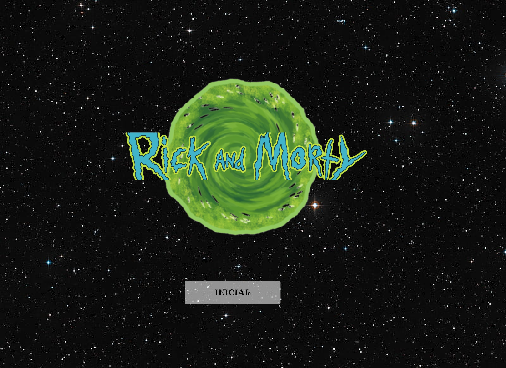

# DATA LOVERS RICK AND MORTY

## ¿EN QUE CONSISTE EL PROYECTO?

  Este proyecto  consiste en desarrollar una página web que permita al usuario visualizar la data de los personajes de la serie  Rick y Morty de manera ordenada a través de varias formas de filtrado.  

### USUARIO OBJETIVO

  Identificamos como usuario objetivo a los fans de la serie, quienes difrutan el obtener mayor información sobre los personajes de la serie.

### ¿QUE NECESIDAD O PROBLEMA RESUELVE NUESTRA WEB?

  la necesidad que cubre esta página es la de obtener de manera ordenada información puntual sobre los personajes que han salido a lo largo de toda la serie, facilitando  la investigación por parte de los fans interesados.  

#### HISTORIA DE USUARIO

  Como resultado de nuestro proceso de investigación de usuario, desarrollamos 4 UH.

    Historia de usuario 1: Yo como fan de la serie quiero ver los personajes de la serie y poder agruparlos según su estado de vida para tener clara esa información como fanático.

    Historia de usuario 2: Yo como fan quiero poder ver clasificados los personajes por especie para saber cuantas especies han aparecido en la serie.

    Historia de usuario 3: Yo como fan quiero ver la informacion de cuantos capitulos ha salido mi personaje filtrado.
    
    Historia de usuario 4: Yo como  fan  quiero poder saber cuantos Ricks han muerto hasta el momento.

  Con lo cual desarrollamos el prototipo de nuestra pagina.  

  

  

  

De las historias de usuario, realizamos pequeñas tareas, uniendo la historia de usuario 1 a la 3 en una sola tarea, lo cual fue realizar las diferentes opciones de filtro.

Con la cuarta Historia de Usuario, realizamos el conteo de Ricks que se encuentran en la data y filtramos por los que se encuentran muertos, retornando el dato en la pagina web.
#### PRUEBAS UNITARIAS
se reliazaron pruebas con varios usuarios los cuales señalaron los siguientes inconvenientes:
Poca claridad en cuanto a los nombres de los filtros.
las tarjetas estaban pequeñas  y la información no se lee de forma clara.